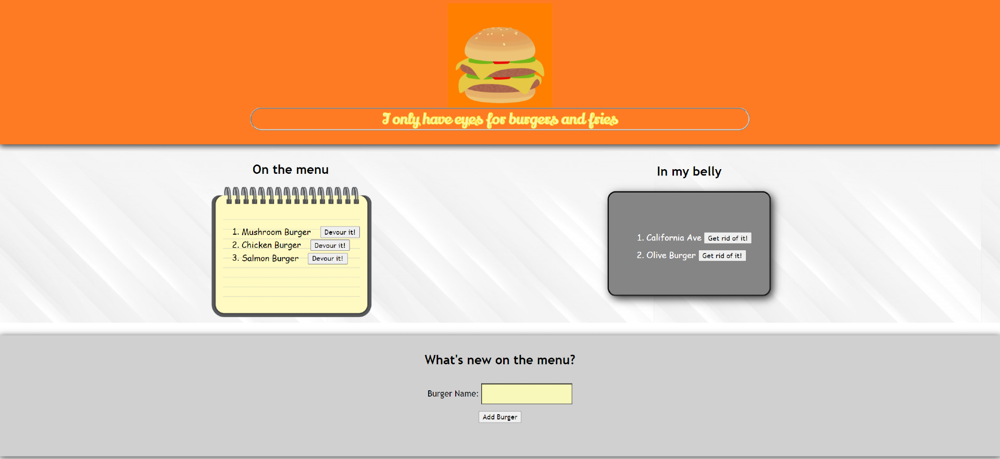

# Burger_Devourer
## Description

The Burger Devourer is a fun application that displays my knowledge in MVC and how to provide the user with the ability to view the content, create something new within the content, update, and delete. This is done through the Node.js server while using the npm packages Express, Handlebars, and MySQL. 
With Node and Express, I am able to connect MySQL workbench so I could have a running database. With this, I am able to configure this data through my ORM and model files of my application. This information would then be passed through the controller and onto the views file which contains the content to display the application and to provide the functions listed above for the user. The main webpage is generated through Handlebars. Once the user inputs their information, it will then pass through to the controller, and back down to the MySQL database for any database modifications. I have deployed this application through Heroku. 

## Table of Contents

* [License](#license)
* [Contributing](#contributing)
* [Screenshot](#screenshot)
* [Link](#link)
* [Questions](#questions)

## License

MIT

## Contributing

Ianaac27

# Screenshot
Here is a mock of the Burger Devourer.

# Link
Take a look at the live version through Heroku [here.](https://burger-devourer-mvc.herokuapp.com/)

## Questions

If you have any questions, please refer to my contact information below.

[GitHub: Ianaac27](https://www.github.com/Ianaac27)

Email: ian.fleshmancooper@gmail.com
